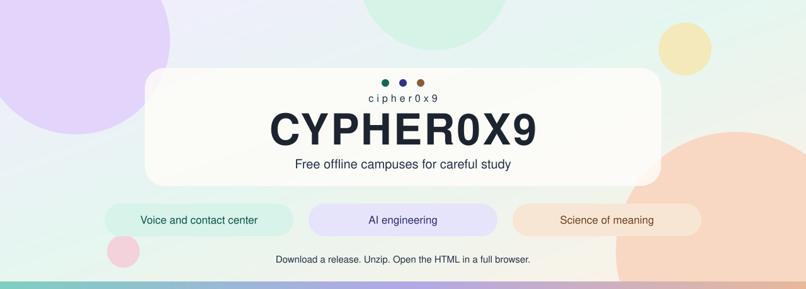
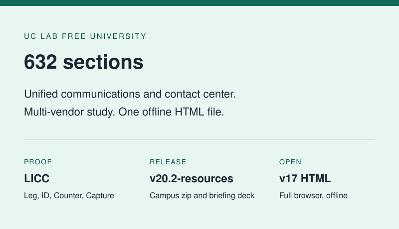
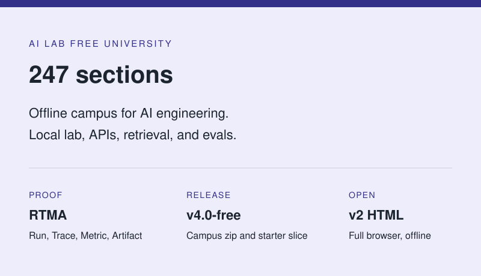
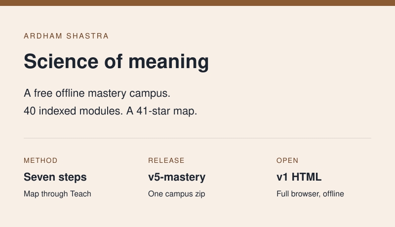

  

# cipher0x9

Three free offline campuses. Download a zip, unzip it, and open the HTML file in Chrome, Safari, Edge, or Firefox.

## Campuses

<table>
  <tr>
    <td align="center" width="33%">
      
    </td>
    <td align="center" width="33%">
      
    </td>
    <td align="center" width="33%">
      
    </td>
  </tr>
  <tr>
    <td valign="top">
      <strong><a href="https://github.com/cipher0x9/uc-lab-free-university-mesmerizing">UC Lab Free University</a></strong> 
      A free offline campus for unified communications and contact center. The curriculum is 632 sections across seven themes, and its proof habit is LICC: Leg, ID, Counter, Capture.
        
      <a href="https://github.com/cipher0x9/uc-lab-free-university-mesmerizing/releases/download/v20.2-resources/v17-UNIVERSITY.html.zip">Campus download</a>
    </td>
    <td valign="top">
      <strong><a href="https://github.com/cipher0x9/ai-lab-free-university-mesmerizing">AI Lab Free University</a></strong> 
      A free offline campus for AI engineering. It has 247 sections across mentor schools, and its proof habit is RTMA: Run, Trace, Metric, Artifact.
        
      <a href="https://github.com/cipher0x9/ai-lab-free-university-mesmerizing/raw/main/zips/v2-UNIVERSITY.html.zip">Campus download</a>
    </td>
    <td valign="top">
      <strong><a href="https://github.com/cipher0x9/ardham-shastra">Ardham Shastra</a></strong> 
      A free offline campus on the science of meaning. The notes index forty modules, and the method is Map, Grammar, Reason, Practice, Prove, Space, Teach.
        
      <a href="https://github.com/cipher0x9/ardham-shastra/releases/download/v5-mastery/v1-ARDHAM-SHASTRA.html.zip">Campus download</a>
    </td>
  </tr>
</table>

[MIT](LICENSE) · [@cipher0x9](https://github.com/cipher0x9)
