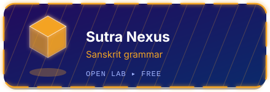
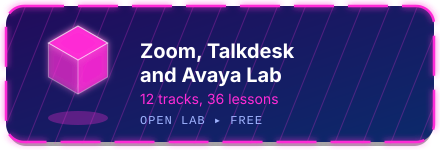
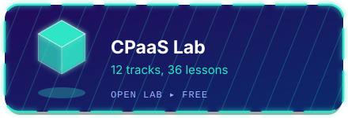
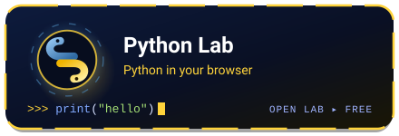

<picture><source media="(prefers-color-scheme: dark)" srcset="assets/banner-dark.svg"><source media="(prefers-color-scheme: light)" srcset="assets/banner-light.svg"></picture>

<picture><source media="(prefers-color-scheme: dark)" srcset="assets/typing-dark.svg"><source media="(prefers-color-scheme: light)" srcset="assets/typing-light.svg"></picture>

  

 

  

<picture><source media="(prefers-color-scheme: dark)" srcset="assets/divider-dark.svg"><source media="(prefers-color-scheme: light)" srcset="assets/divider-light.svg"></picture>

## 👾 About Me

<table><tr>
<td width="62%" valign="top">

<ul>
<li>🐒 I'm <b>Lucky, aka Cypher Monkey</b>, a lifelong student and AI enthusiast.</li>
<li>🧭 I come from systems, networking, voice and contact center, and I'm now moving into <b>AI omni-channel agents</b>.</li>
<li>🧪 I run <b>CypherMonkeyLabs</b>: thirteen free labs across voice, contact center, CPaaS, SIP, AI, Python and business analysis, plus Sutra Nexus for Sanskrit.</li>
<li>🎓 My belief: <b>learning should be free for everyone</b>.</li>
<li>🌐 Home base: <a href="https://cyphermonkeylabs.com">cyphermonkeylabs.com</a></li>
<li>💬 Ask me about voice, contact centers, SIP, AI agents and learning by building.</li>
</ul>

</td>
<td width="38%" align="center"></td>
</tr></table>

<picture><source media="(prefers-color-scheme: dark)" srcset="assets/divider-dark.svg"><source media="(prefers-color-scheme: light)" srcset="assets/divider-light.svg"></picture>

## 🌌 My Universe

## 🧪 Thirteen Free Labs, Plus Sutra Nexus

<table>
<tr><td align="center" width="33%"> 🚀 <a href="https://cyphermonkeylabs.com/uc-lab-free-university-mesmerizing/">Open app</a> · 📦 <a href="https://github.com/CypherMonkeyLabs/uc-lab-free-university-mesmerizing">View repo</a></td><td align="center" width="33%"> 🚀 <a href="https://cyphermonkeylabs.com/ai-lab-free-university-mesmerizing/">Open app</a> · 📦 <a href="https://github.com/CypherMonkeyLabs/ai-lab-free-university-mesmerizing">View repo</a></td><td align="center" width="33%"> 🚀 <a href="https://cyphermonkeylabs.com/amazon-connect-lab-free-university-mesmerizing/">Open app</a> · 📦 <a href="https://github.com/CypherMonkeyLabs/amazon-connect-lab-free-university-mesmerizing">View repo</a></td></tr>
<tr><td align="center" width="33%"> 🚀 <a href="https://cyphermonkeylabs.com/microsoft-voice-cc-lab-free-university-mesmerizing/">Open app</a> · 📦 <a href="https://github.com/CypherMonkeyLabs/microsoft-voice-cc-lab-free-university-mesmerizing">View repo</a></td><td align="center" width="33%"> 🚀 <a href="https://cyphermonkeylabs.com/webex-lab-free-university-mesmerizing/">Open app</a> · 📦 <a href="https://github.com/CypherMonkeyLabs/webex-lab-free-university-mesmerizing">View repo</a></td><td align="center" width="33%"> 🚀 <a href="https://cyphermonkeylabs.com/five9-lab-free-university-mesmerizing/">Open app</a> · 📦 <a href="https://github.com/CypherMonkeyLabs/five9-lab-free-university-mesmerizing">View repo</a></td></tr>
<tr><td align="center" width="33%"> 🚀 <a href="https://cyphermonkeylabs.com/genesys-cloud-lab-free-university-mesmerizing/">Open app</a> · 📦 <a href="https://github.com/CypherMonkeyLabs/genesys-cloud-lab-free-university-mesmerizing">View repo</a></td><td align="center" width="33%"> 🚀 <a href="https://cyphermonkeylabs.com/nice-cxone-lab-free-university-mesmerizing/">Open app</a> · 📦 <a href="https://github.com/CypherMonkeyLabs/nice-cxone-lab-free-university-mesmerizing">View repo</a></td><td align="center" width="33%"> 🚀 <a href="https://cyphermonkeylabs.com/sip-universe-lab-free-university-mesmerizing/">Open app</a> · 📦 <a href="https://github.com/CypherMonkeyLabs/sip-universe-lab-free-university-mesmerizing">View repo</a></td></tr>
<tr><td align="center" width="33%"> 🚀 <a href="https://cyphermonkeylabs.com/ba-lab-grok-free-university-mesmerizing/">Open app</a> · 📦 <a href="https://github.com/CypherMonkeyLabs/ba-lab-grok-free-university-mesmerizing">View repo</a></td><td align="center" width="33%"> 🚀 <a href="https://cyphermonkeylabs.com/sutra-nexus/">Open app</a> · 📦 <a href="https://github.com/CypherMonkeyLabs/sutra-nexus">View repo</a></td><td align="center" width="33%"> 🚀 <a href="https://cyphermonkeylabs.com/zoom-talkdesk-avaya-lab-free-university-mesmerizing/">Open app</a> · 📦 <a href="https://github.com/CypherMonkeyLabs/zoom-talkdesk-avaya-lab-free-university-mesmerizing">View repo</a></td></tr>
<tr><td align="center" width="33%"> 🚀 <a href="https://cyphermonkeylabs.com/cpaas-lab-free-university-mesmerizing/">Open app</a> · 📦 <a href="https://github.com/CypherMonkeyLabs/cpaas-lab-free-university-mesmerizing">View repo</a></td><td align="center" width="33%"> 🚀 <a href="https://cyphermonkeylabs.com/python-lab-free-university-mesmerizing/">Open app</a> · 📦 <a href="https://github.com/CypherMonkeyLabs/python-lab-free-university-mesmerizing">View repo</a></td><td></td></tr>
</table>

➕ More: <a href="https://cyphermonkeylabs.com/gemini-gems-free-gallery/">Gemini Gems</a>

<picture><source media="(prefers-color-scheme: dark)" srcset="assets/divider-dark.svg"><source media="(prefers-color-scheme: light)" srcset="assets/divider-light.svg"></picture>

## 🎮 Player Card

## 🏆 Achievements

## ⚡ Level Up

## 🛠️ Tech Arsenal

## 🧭 Journey

<picture><source media="(prefers-color-scheme: dark)" srcset="assets/divider-dark.svg"><source media="(prefers-color-scheme: light)" srcset="assets/divider-light.svg"></picture>

## 📊 GitHub Stats

 

Generated by a GitHub Action in this repo (<code>scripts/gen_stats.py</code>) every 12 hours. No third-party service.

## 🐍 Contribution Snake

<picture><source media="(prefers-color-scheme: dark)" srcset="https://raw.githubusercontent.com/cipher0x9/cipher0x9/output/github-snake-dark.svg"></picture>

<picture><source media="(prefers-color-scheme: dark)" srcset="assets/divider-dark.svg"><source media="(prefers-color-scheme: light)" srcset="assets/divider-light.svg"></picture>

## 📡 Contact

  

 

⚠️ **Disclaimer:** independent educational projects. Not affiliated with, endorsed by, or sponsored by any vendor or product named here; all trademarks belong to their owners. Code is **MIT** licensed · written content is **CC BY-NC-SA**.

